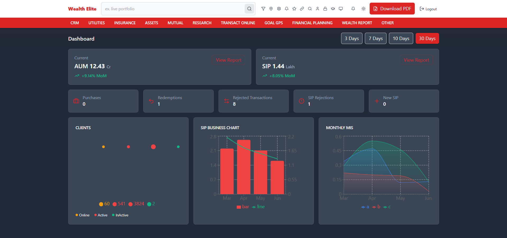

# Wealth Elite Financial Dashboard (Next.js)

A modern, responsive financial dashboard built with Next.js and Tailwind CSS. This dashboard provides insights into AUM, SIP, transactions, and client data, featuring interactive charts and PDF generation.



## Features

- Dashboard with key financial stats
- Interactive charts (Area, Bar/Line, Bubble)
- Data filtering and stats cards
- PDF report generation
- Dark/light theme toggle
- Modular, component-based architecture

## Tech Stack

- [Next.js](https://nextjs.org/)
- [React](https://react.dev/)
- [TypeScript](https://www.typescriptlang.org/)
- [Tailwind CSS](https://tailwindcss.com/)

## Getting Started

### Prerequisites

- [Node.js](https://nodejs.org/) (v18 or above recommended)
- [npm](https://www.npmjs.com/) or [yarn](https://yarnpkg.com/)

### Installation

1. **Clone the repository:**
   ```sh
   git clone <repo-url>
   cd Wealth-Elite-Financial-Dashboard-nextjs
   ```
2. **Install dependencies:**
   ```sh
   npm install
   # or
   yarn install
   ```

### Running the Development Server

```sh
npm run dev
# or
yarn dev
```

Visit [http://localhost:3000](http://localhost:3000) to view the dashboard.

### Building for Production

```sh
npm run build
npm start
# or
yarn build
yarn start
```

### Project Structure

```
app/                # Next.js app directory
  api/              # API routes for dashboard data
  (loading)/        # Loading UI
  globals.css       # Global styles
  layout.tsx        # Root layout
  page.tsx          # Main dashboard page
components/         # Reusable UI components
  charts/           # Chart components
  dashboard/        # Dashboard-specific components
  ui/               # UI primitives
lib/                # Utility and data functions
public/             # Static assets (if any)
```

### Customization

- **Add new charts:** Place new chart components in `components/charts/` and use them in the dashboard.
- **API routes:** Update or add new API endpoints in `app/api/` as needed.
- **Styling:** Modify `tailwind.config.ts` and `globals.css` for custom styles.

### Scripts

- `npm run dev` — Start development server
- `npm run build` — Build for production
- `npm start` — Start production server
- `npm run lint` — Lint code

### License

MIT

---

For questions or support, please open an issue or contact the maintainer.
